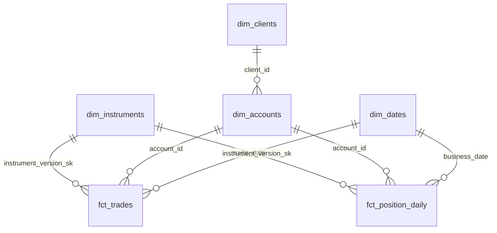
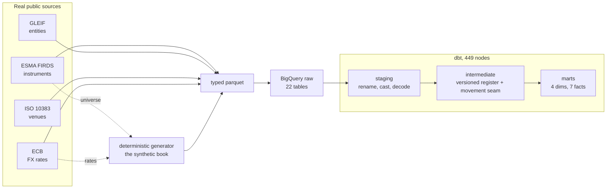
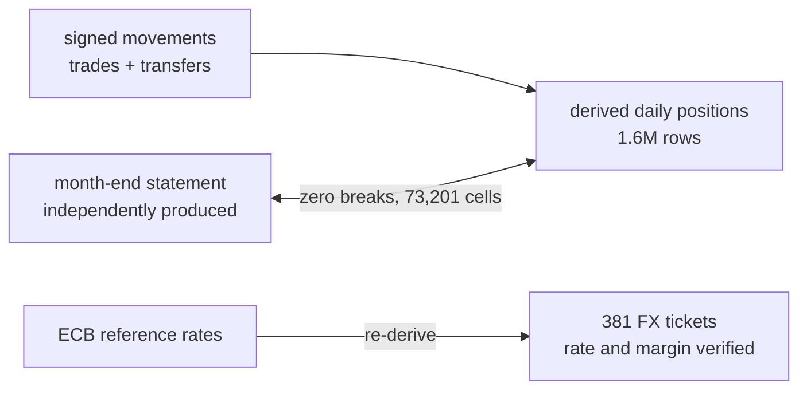

# finance-data-platform


A daily private-banking risk platform on BigQuery and dbt: real regulatory
reference data, a deterministic synthetic book trading it, and a star schema
whose centrepiece is a versioned instrument dimension and a derived position
stream reconciled against an independent statement.

## What it produces

One warehouse, four layers. Raw mirrors each source exactly as delivered.
Staging renames, types and decodes once. An intermediate layer builds the
type 2 instrument register and the signed movement seam. The marts are a
star schema: four dimensions (instruments, accounts, clients, dates) and
seven facts (trades, transfers, cash events, FX conversions, position
snapshots, prices, and a derived daily position book of 1.6M rows valued at
the day's price).



Two of the seven facts shown; all seven join the same way, through the
version key each fact resolved once at build time.

## Data

Everything shipped or fetched here is public data published for reuse; the
book that trades it is generated, because no real dataset of private-banking
positions exists.

| source | what | size |
|---|---|---|
| ESMA FIRDS | the EU instrument register: weekly full file plus 14 days of daily deltas | 14.7M + 10.6M rows |
| GLEIF | the LEI golden copy: legal entities and hierarchy | 3.4M entities |
| ISO 10383 | market identifier codes, venues and operators | 2,864 MICs |
| ECB | euro foreign exchange reference rates since 1999 | 219,817 rates, 41 currencies |
| generated | the synthetic book: clients, accounts, desks, two years of trading | 13 tables, 489,315 rows |

The generator is deterministic end to end: one seed produces one combined
content hash, pinned in CI and verified byte-identical across CPU
architectures. Every pull request re-proves reproducibility by running the
generator twice against a committed kilobyte-scale fixture. The book is
textured on purpose: a disclosed imperfection layer carries forward some
prices and omits single days entirely, private clients have no LEI, and a
roster of ten named defects can be injected into a separate output to
demonstrate each test failing. The canonical dataset ships with defects off.

## Architecture

Acquisition scripts download and verify each source, a shredder turns FIRDS
XML into typed parquet, and a loader stages everything to BigQuery through
GCS with atomic truncate-and-replace loads. dbt owns everything after raw:
449 nodes build and test the full graph. Positions are derived from
movements, never loaded in parallel; prices are the one incremental model,
replaced partition by partition.



The dashed edges are the honesty of the design: the generator prices its
FX against the same ECB file the warehouse ingests and trades only
instruments the register actually lists, which is what makes both
cross-source checks below possible.

## The instrument dimension

FIRDS publishes its own change history, so the register is consumed the way
ESMA prescribes: register the full file, then replay each day's delta by
publication date. Terminations close a version and keep history;
cancellations erase a key entirely, because an erratum has no interval
semantics. The result is 24.6M version rows, partitioned and clustered so
one as-of lookup reads 489 MB instead of 7.43 GB. The mart-level dimension
narrows to the 641 instrument and venue pairs the book actually trades,
carries every version of those keys, and resolves each fact once at build
time into a stored surrogate key, so downstream joins never repeat the
range logic.

## Positions

The book publishes month-end custody snapshots produced independently of
the movement stream, which is what makes the derivation testable: derived
quantities are compared against the statement at every month-end cell, in
both directions, absence counting as zero. The comparison currently holds
at zero breaks across 73,201 cells. The identity closing = opening + sum of
movements is kept only as a window-function check, because it computes both
sides from the same rows and cannot fail; the reconciliation against the
independent statement is the test with teeth.

## Data quality

445 of 449 nodes pass; the four warnings are deliberate quarantines, kept
at warn severity with their reasons documented in the schema files: five
LEIs destroyed by spreadsheet notation in ISO's own file, and far-future
maturity dates that are issuer conventions rather than corruption. The
price feed discloses its texture: 1,967 rows carry a previous close and 411
instruments miss exactly one print, which valuation bridges with a carried
price marked as such. Tests live where the guarantee lives: source
contracts are regression tripwires against the loader, staging and marts
test grain, domains, referential integrity, and the checks with an
independent other side: the position reconciliation, and an FX check that
re-derives all 381 conversions from the ECB reference file and verifies
the house margin to the cent.



CI runs two tiers. Every pull request lints, tests, and compiles the entire
project against the warehouse with zero-row builds, which catches missing
variables, dangling references and invalid DDL for approximately nothing.
Every merge to main executes the full build.

## Running it

Python 3.12, a GCP project with BigQuery and GCS, and a service account
key. The keyfile path is read from the environment; nothing about
credentials lives in the repo.

```
python3.12 -m venv .venv
.venv/bin/pip install -r requirements.txt -r requirements-dev.txt
export GCP_KEYFILE=/path/to/service-account.json

.venv/bin/python scripts/acquisition/download_esma_firds.py
.venv/bin/python scripts/acquisition/download_esma_firds.py --since 2026-07-18 --until 2026-07-31
.venv/bin/python scripts/acquisition/download_gleif.py
.venv/bin/python scripts/acquisition/download_iso_mic.py
.venv/bin/python scripts/acquisition/download_ecb_fxref.py
.venv/bin/python -m ingestion.esma_firds.shred
.venv/bin/python -m ingestion.esma_firds.shred --kind dltins
.venv/bin/python -m ingestion.calendar.build
.venv/bin/python -m ingestion.generate.cli
.venv/bin/python scripts/load_bigquery.py

cd dbt && dbt deps && dbt build
```

Project and dataset names are set in `scripts/load_bigquery.py` and
`dbt/profiles.yml`; point them at your own project. The FIRDS snapshot
date is pinned as `firds_base_date` in `dbt_project.yml`: a fresh
download starts a newer register window, so the pin and the delta range
move together.

## Decisions

Architecture decision records live in `docs/adr/`, one page each: why the
instrument dimension is partitioned and clustered the way it is, why
positions are derived rather than loaded, and why the price feed replaces
partitions instead of merging rows.

## Honest limits

Orchestration is next: the pipeline currently runs by invoking the steps in
order, and an Airflow DAG is the immediate roadmap. Daily P&L and the cash
ledger are deferred together until both can share one signed-flow
valuation. Prices are a disclosed one-factor simulation, not market data,
because market data is licensed and this repository only ships what may be
reshipped. There are no corporate actions beyond coupons, dividends and
redemptions. The streaming revaluation layer and cloud deployment described
in early commits are later phases, not present tense.
